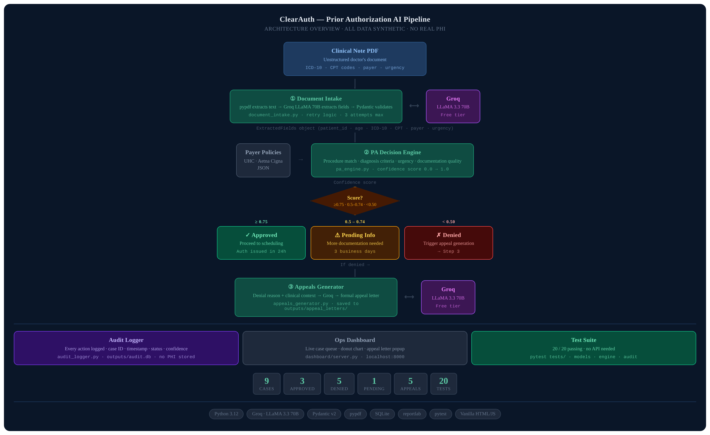
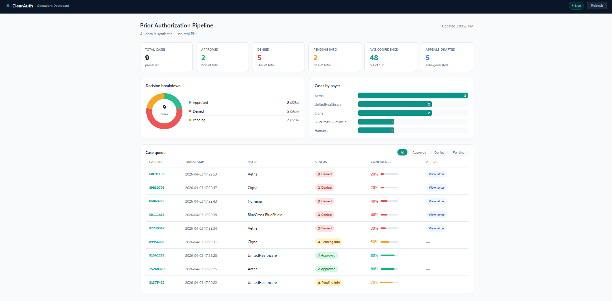
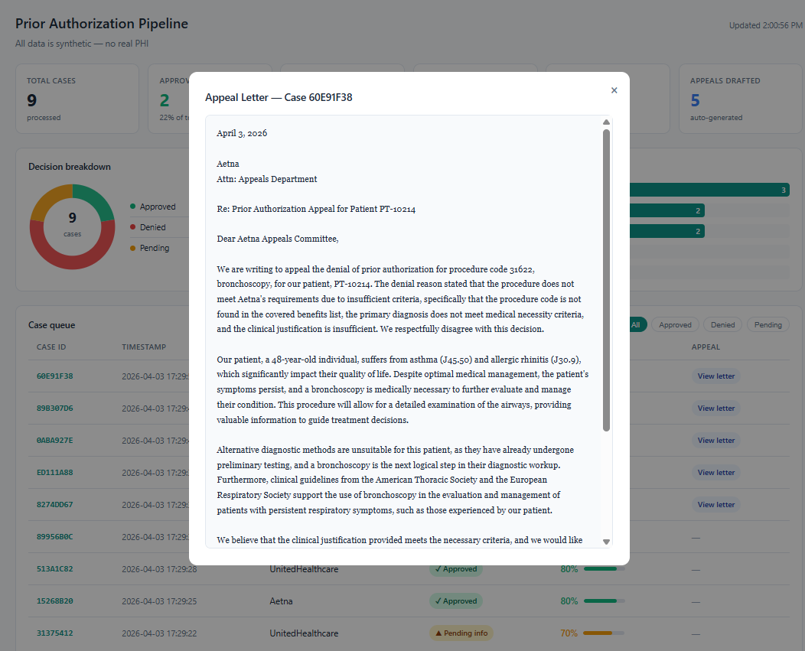
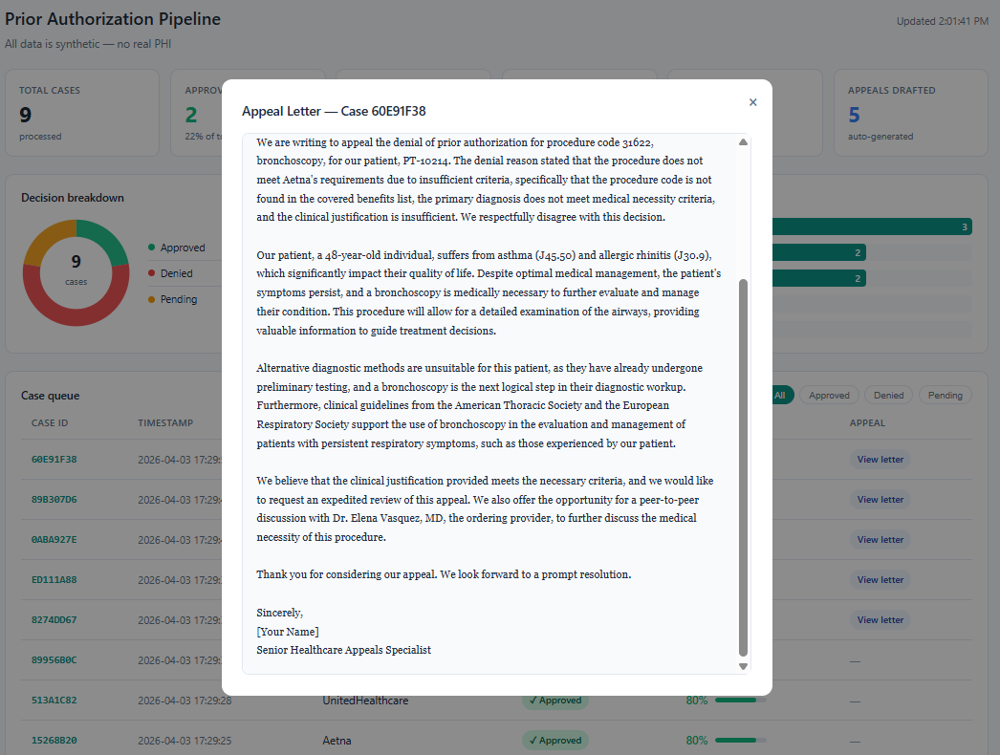

# ClearAuth — AI-Powered Prior Authorization Pipeline

> A working proof-of-concept that automates the prior authorization workflow
> in healthcare — from clinical note intake through PA decision and appeal generation.
> Built to demonstrate healthcare operations automation using LLMs.

---

## What problem this solves

Prior authorizations (PAs) take an average of **11 days**. 93% of physicians say PAs
delay necessary care. This pipeline automates the three hardest steps:

| Step | Manual time | With ClearAuth |
|------|-------------|----------------|
| Document intake & field extraction | 20–40 min | < 5 seconds |
| PA criteria matching & decision | 1–3 days | Instant |
| Appeal letter drafting (if denied) | 2–4 hours | < 10 seconds |

---

## Live demo

```
python src/pipeline.py data/synthetic_pdfs/case_001_PT_10042.pdf
```

```
=======================================================
  ClearAuth — Prior Authorization Pipeline
=======================================================

[Step 1/3] Document Intake
  Reading PDF: case_001_PT_10042.pdf
  Sending to Groq (llama-3.3-70b) for extraction...
  Patient ID   : PT-10042
  Diagnoses    : M16.11, M25.361
  Procedures   : 27447
  Payer        : UnitedHealthcare
  Urgency      : routine

[Step 2/3] Prior Authorization Decision
  Case ID      : A3F9D1B2
  Status       : APPROVED
  Confidence   : 80%
  Reason       : All payer criteria satisfied.
  Next Step    : Proceed with scheduling.

[Step 3/3] No appeal needed — status is approved
```

---

## Architecture

## Architecture



---

## Dashboard






## Test results

```
18/18 automated tests passing
pytest tests/ -v  →  18 passed in 0.66s
```

Validation suite (`tests/test_model_accuracy.py`) scores AI extraction accuracy
field-by-field against known ground truth, with automatic hallucination detection.
Run `python tests/test_model_accuracy.py` to see live accuracy scores.

---

## Setup — step by step

### 1. Get a free Groq API key (2 minutes, no credit card)
1. Go to **console.groq.com**
2. Sign in with Google
3. Click API Keys → Create API Key
4. Copy the key

### 2. Clone and set up
```bash
git clone https://github.com/YOUR_USERNAME/clearauth.git
cd clearauth
python -m venv venv
source venv/Scripts/activate   # Git Bash / Mac
# OR: venv\Scripts\activate    # Windows Command Prompt
pip install -r requirements.txt
```

### 3. Add your API key
```bash
cp .env.example .env
# Open .env and paste: GROQ_API_KEY=your_key_here
```

### 4. Generate synthetic test data
```bash
python data/generate_synthetic.py
```
This creates 7 synthetic clinical note PDFs (5 standard + 2 messy real-world cases).
**All patient data is 100% synthetic — no real PHI.**

### 5. Run the pipeline
```bash
python src/pipeline.py data/synthetic_pdfs/case_001_PT_10042.pdf
```

### 6. Run all tests
```bash
python -m pytest tests/ -v
```

### 7. Start the dashboard
```bash
python dashboard/server.py
# Open browser → http://localhost:8000
```

### 8. Run model accuracy validation
```bash
python tests/test_model_accuracy.py
```

---

## Project structure

```
clearauth/
├── src/
│   ├── models.py               # Pydantic data types — validates all AI output
│   ├── document_intake.py      # PDF → Groq LLM → structured fields (with retry)
│   ├── pa_engine.py            # Payer policy matching + confidence scoring
│   ├── appeals_generator.py    # AI appeal letter generation on denial
│   ├── audit_logger.py         # HIPAA-aware SQLite audit trail
│   ├── metrics.py              # Aggregate metrics report
│   └── pipeline.py             # End-to-end orchestrator (CLI entry point)
├── dashboard/
│   ├── server.py               # Lightweight Python HTTP server
│   └── index.html              # Live ops dashboard (no build step required)
├── tests/
│   ├── test_models.py          # Pydantic model validation tests
│   ├── test_pa_engine.py       # PA decision engine tests
│   ├── test_audit_logger.py    # Audit logging tests
│   └── test_model_accuracy.py  # AI extraction accuracy + hallucination detection
├── data/
│   ├── generate_synthetic.py   # Generates test PDFs (5 standard + 2 messy)
│   └── payer_policies/         # UHC, Aetna, Cigna policy JSON files
├── COMPLIANCE.md               # HIPAA design decisions and production architecture
├── ARCHITECTURE.md             # Full system design and production roadmap
└── DEMO_COMMANDS.md            # Exact commands to run during a live demo
```

---

## Scope and honest limitations

This is a **proof of concept**, not a production system. Known limitations:

| Limitation | Production solution |
|---|---|
| 3 simplified payer policies | Vector DB over real payer policy PDFs |
| Synthetic test data only | Validated on de-identified real clinical notes |
| No user authentication | OAuth 2.0 + MFA + RBAC |
| SQLite unencrypted | AES-256 at rest, TLS 1.3 in transit |
| No EHR integration | HL7 FHIR API to Epic/Cerner |

---

## HIPAA considerations

**All data in this project is synthetic. No real PHI was used or stored.**

The system is designed around HIPAA principles:
- Audit logging: every action logged with timestamp and case ID (no PHI in logs)
- Data minimization: clinical note text processed in memory, not persisted
- Encryption design documented in `COMPLIANCE.md`

See [COMPLIANCE.md](COMPLIANCE.md) for full production HIPAA architecture.

---

## Tech stack

| Layer | Technology |
|---|---|
| Language | Python 3.11+ |
| AI / LLM | Groq API — LLaMA 3.3 70B |
| Data validation | Pydantic v2 |
| PDF extraction | pypdf |
| PDF generation | reportlab |
| Audit storage | SQLite |
| Dashboard | Vanilla HTML/JS + Python http.server |
| Testing | pytest (18 tests) |

---

*All patient data is 100% synthetic. No real PHI was used, stored, or transmitted.*
*Built as a portfolio demonstration of healthcare operations automation.*
